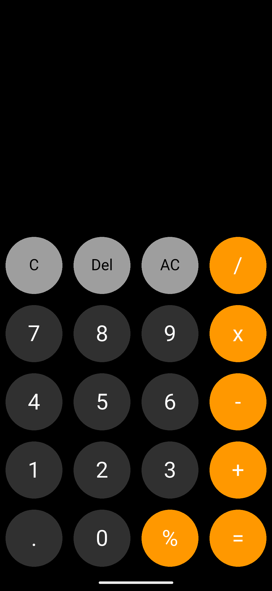
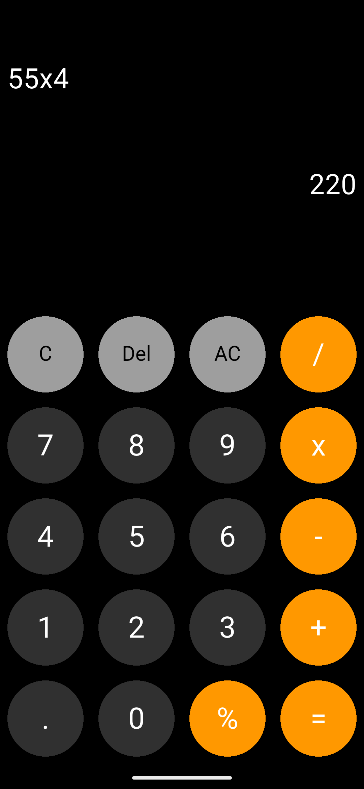

# 🧮 Flutter Calculator App

A simple and elegant calculator app built using Flutter. It provides basic arithmetic operations with a clean UI and efficient logic handling.

## 🚀 Features

* Responsive Grid Layout:
Uses a GridView to display calculator buttons in a neat grid format.

* Expression Parsing:
Integrated the math_expressions package to parse and evaluate mathematical expressions.

* Error Handling:
Handles common exceptions like:
    - Division by zero
    - Invalid input expressions

* Real-time Calculation:
Displays results dynamically as users input expressions.

## 🧱 Tech Stack

* Framework: Flutter
* Language: Dart
* Packages Used:
    * math_expressions → for expression parsing and evaluation

## 📸 Preview

<table align="center" border="0" cellspacing="0">
  <tr>
    <td align="center" width="50%">
      
    </td>
    <td align="center" width="50%">
      
    </td>
  </tr>
</table>

