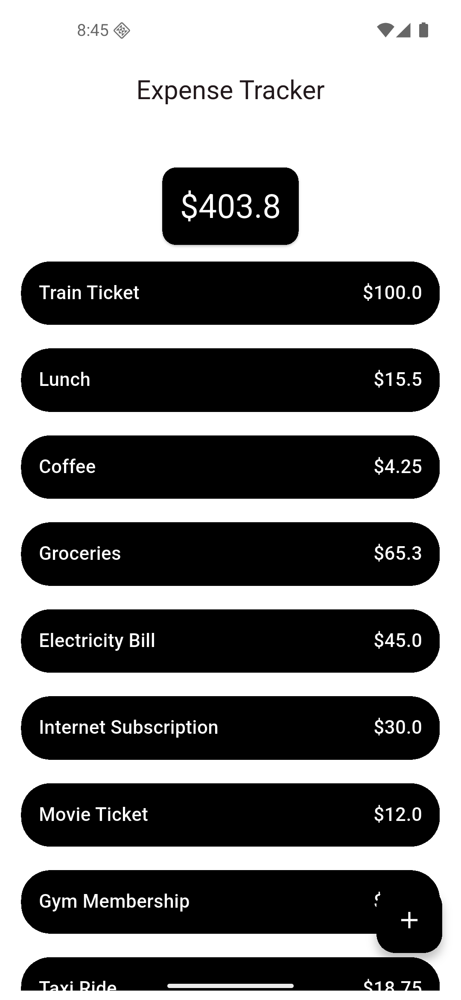
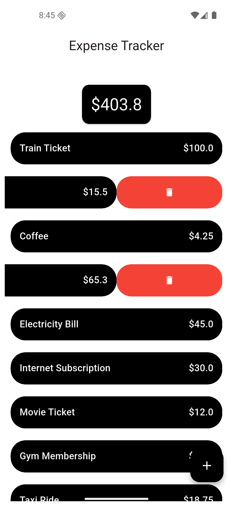
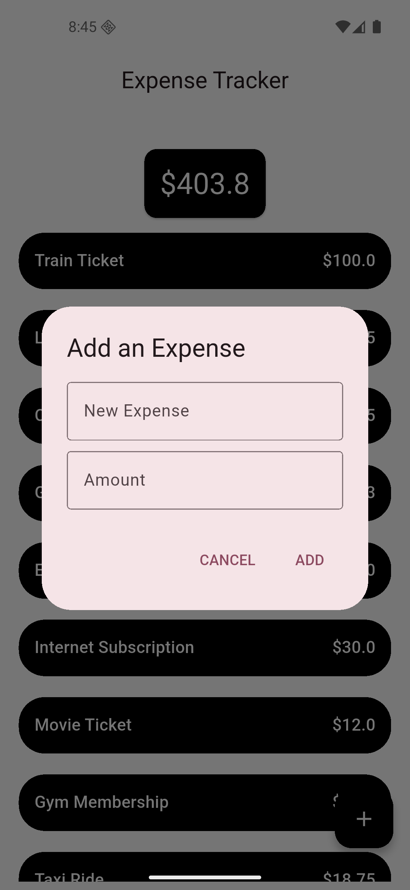

# 💰 Flutter Expense Tracker

A simple and intuitive Expense Tracker app built using Flutter.

## 🚀 Features

- Dynamic Expense List:
  Uses ListView.builder to display a scrollable list of expenses efficiently.

- Total Summary Card:
  Shows the total expenses at the top inside a stylish Card widget.

- Local Storage with Hive:
  Stores all expense data locally using the fast and lightweight Hive database.

- Swipe to Delete:
  Integrated the flutter_slidable package to enable a smooth slide-to-delete action on expense items.

- Clean UI:
  Simple, user-friendly interface designed for quick expense tracking.

## 🧱 Tech Stack

- Framework: Flutter
- Language: Dart
- Packages Used:
  - hive → for local storage
  - flutter_slidable → for swipe-to-delete functionality

<table align="center" border="0" cellspacing="0">
  <tr>
    <td align="center" width="50%">
      
    </td>
    <td align="center" width="50%">
      
    </td>
  </tr>
  <tr>
    <td align="center" width="50%">
      
    </td>
  </tr>
</table>
