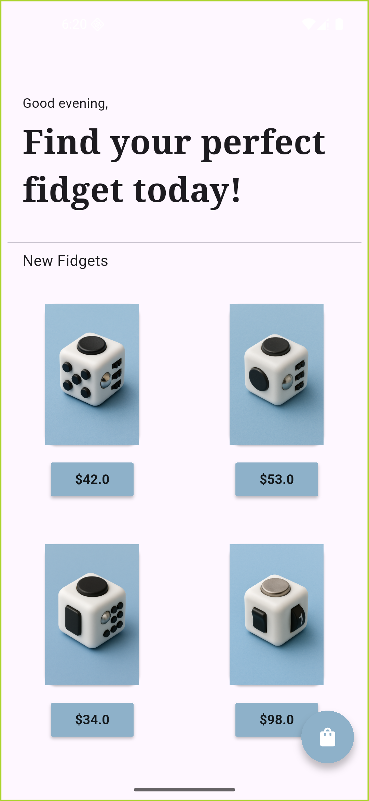
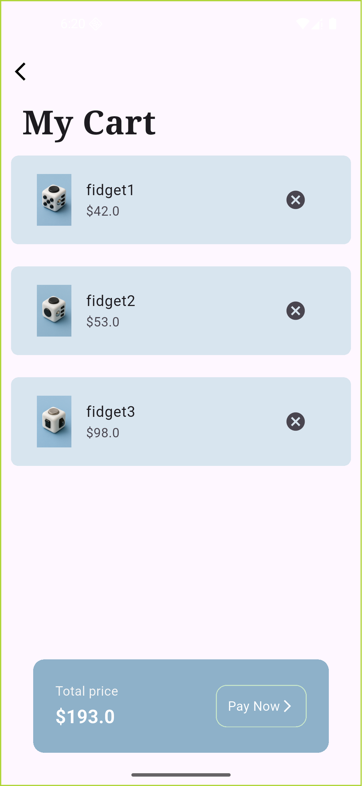

# 🪀 Flutter Fidget Store App

A simple and functional **Fidget Store App** built using **Flutter**.  
This project demonstrates the use of **Provider** state management in a small e-commerce-style application.

## 🛍️ Overview

The app showcases a limited catalog of **fidgets** that users can browse and add to their cart.  
It focuses primarily on implementing **Provider** for efficient and reactive state management.

## 🚀 Features

- 🧸 **Fidget Catalog:**  
  Displays a list of available fidgets, each with an **“Add to Cart”** button.
- 🛒 **Cart Management with Provider:**  
  Items are added to the cart using **Provider**, updating the cart in real time.
- ➕ **Floating Action Button:**  
  Opens the **Cart Screen**, showing all items currently in the cart.
- ❌ **Item Removal:**  
  Each cart item includes a delete button to remove it from the cart.
- 💵 **Total Price Card:**  
  Displays the total cost of all items in the cart.
- 🧩 **Provider State Management:**  
  The main purpose of this app — demonstrating **Provider** for state updates and UI reactivity.
- ✨ **Custom Fonts:**  
  Integrated with **Google Fonts** for an improved visual experience.

## 🧱 Tech Stack

**Framework:** Flutter  
**Language:** Dart

### 📦 Packages Used

| Purpose          | Package        |
| ---------------- | -------------- |
| State management | `provider`     |
| Custom fonts     | `google_fonts` |

## 📸 Preview

<table align="center" border="0" cellspacing="0">
  <tr>
    <td align="center" width="50%">
      
    </td>
    <td align="center" width="50%">
      
    </td>
  </tr>
</table>
