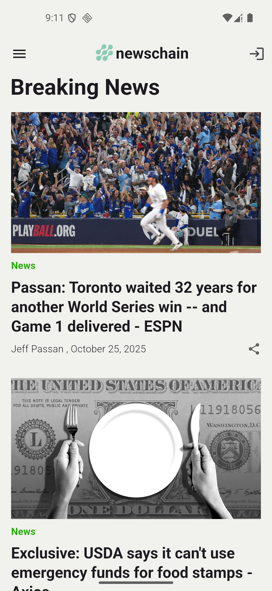

# 📰 Flutter News Reader App

A clean and modern **News Reader App** built with **Flutter** that fetches real-time news articles from the [NewsAPI](https://newsapi.org/) and displays them beautifully on the UI.  
It includes offline caching, formatted timestamps, and an interactive interface.

## 🚀 Features

- 🌍 **Fetch Live News:**  
  Retrieves the latest articles from [NewsAPI.org](https://newsapi.org/).
- 🧾 **Detailed Article Display:**  
  Shows article titles, images, authors, and publication dates.
- 💾 **Offline Caching:**  
  Uses **Hive** for saving fetched news locally to enable offline viewing.
- 🖼️ **Image Caching:**  
  Utilizes `cached_network_image` to cache images for smoother scrolling and reduced network usage.
- 📅 **Formatted Dates:**  
  Uses the `intl` package to display nicely formatted publication dates.
- 🎨 **UI Elements (Mock):**  
  Includes a **drawer**, **logout**, and **share** buttons — currently UI-only, with no backend functionality.

## 🧱 Tech Stack

**Framework:** Flutter  
**Language:** Dart

### 📦 Packages Used

| Purpose         | Package                |
| --------------- | ---------------------- |
| HTTP requests   | `http`                 |
| Date formatting | `intl`                 |
| Local storage   | `hive`, `hive_flutter` |
| Image caching   | `cached_network_image` |

### 🛠️ Dev Dependencies

| Purpose              | Package          |
| -------------------- | ---------------- |
| Hive type generation | `hive_generator` |
| Code generation      | `build_runner`   |

## 📸 Preview

<table align="center" border="0" cellspacing="0">
  <tr>
    <td align="center" width="50%">
      
    </td>
  </tr>
</table>
