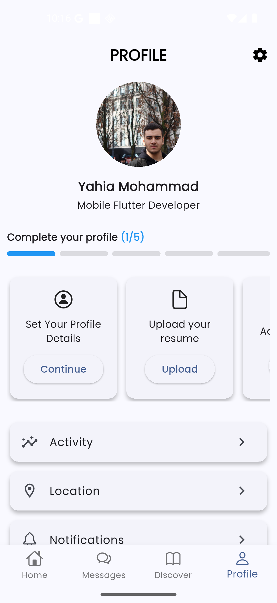

# personal_profile_ui

A clean and modern Flutter Profile UI featuring a user profile picture, role title, progress indicator for profile completion, and quick action cards such as uploading a resume and adding skills. The design also includes navigation tabs (Home, Messages, Discover, Profile) and a minimal, responsive layout suitable for job or networking apps.

