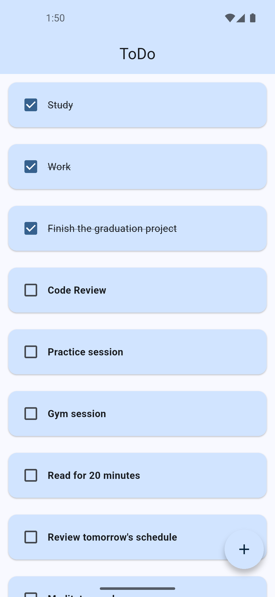
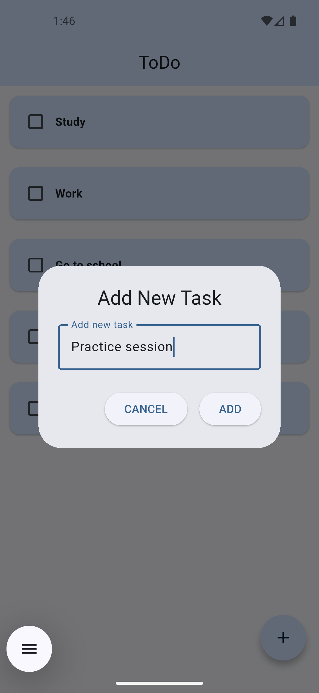
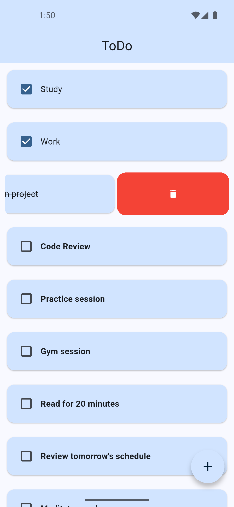

📝 Flutter To-Do App

A simple and elegant To-Do List application built with Flutter, featuring task management with checkboxes, swipe-to-delete functionality, and persistent local storage using Hive.

🚀 Features

✅ Add new tasks using a floating action button that opens a dialog (AlertDialog) with a text field.

🗑️ Delete tasks easily by swiping — powered by the flutter_slidable package.

☑️ Check off completed tasks using checkboxes.

💾 Persistent local storage — tasks are saved locally using Hive, so your data remains even after closing the app.

🧭 Clean and minimal UI for a smooth user experience.

🧩 Packages Used

flutter_slidable
 – for swipe actions on task cards

hive
 & hive_flutter
 – for local data storage

📸 Preview 

<table align="center" border="0" cellspacing="0">
  <tr>
    <td align="center" width="50%">
      
    </td>
    <td align="center" width="50%">
      
    </td>
    <td align="center" width="50%">
      
    </td>
  </tr>
</table>