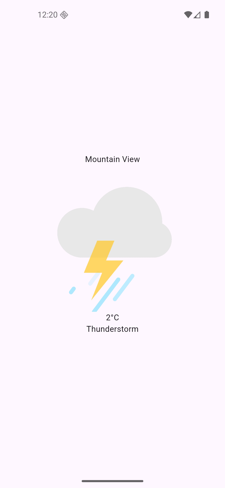
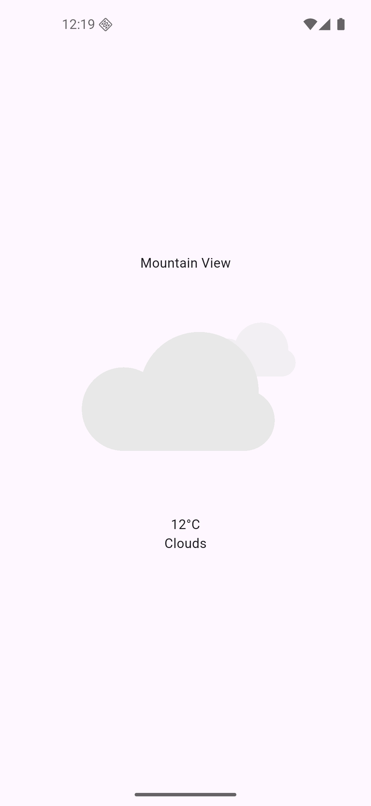

# 🌦️ Flutter Weather App

A beautiful and responsive **Weather App** built using **Flutter**, displaying real-time weather data with animated visuals that match the current conditions.

## 🚀 Features

- 🌍 **Real-time Weather Data:** Fetches live temperature, humidity, and weather conditions using a weather API.
- 📍 **Location Detection:** Automatically detects the user’s location using `geolocator` and `geocoding`.
- 🌤️ **Animated UI:** Uses **Lottie animations** to display weather-specific visuals (e.g., sunny, rainy, cloudy).
- 💾 **Offline Mode:** Implements caching with **Hive** for offline data access.
- ⚡ **Smooth Performance:** Optimized network calls and efficient local storage ensure a seamless experience.

## 🧱 Tech Stack

**Framework:** Flutter  
**Language:** Dart

### 📦 Packages Used

| Purpose                           | Package                |
| --------------------------------- | ---------------------- |
| HTTP requests                     | `http`                 |
| Get user location                 | `geolocator`           |
| Convert coordinates to city names | `geocoding`            |
| Animations                        | `lottie`               |
| Local storage                     | `hive`, `hive_flutter` |

### 🛠️ Dev Dependencies

| Purpose              | Package          |
| -------------------- | ---------------- |
| Hive type generation | `hive_generator` |
| Code generation      | `build_runner`   |

## 📸 Preview

<table align="center" border="0" cellspacing="0">
  <tr>
    <td align="center" width="50%">
      
    </td>
    <td align="center" width="50%">
      
    </td>
  </tr>
</table>
